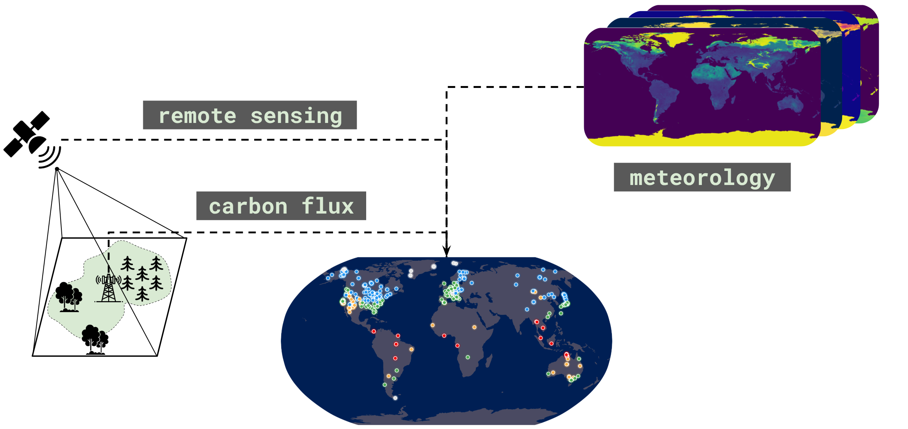

# CarbonBench: A Global Benchmark for Upscaling of Carbon Fluxes Using Zero-Shot Learning

<p align="center">
  
</p>

CarbonBench comprises over 1.3 million daily observations from 567 eddy covariance flux tower sites globally (2000-2024). It provides stratified evaluation protocols that explicitly test generalization across unseen vegetation types and climate regimes, a harmonized set of remote sensing and meteorological features, and reproducible baselines ranging from tree-based methods to domain-generalization architectures.

## Prediction Targets

All targets are derived from eddy covariance measurements standardized under the ONEFlux methodology:

- **GPP** (GPP_NT_VUT_USTAR50): gross primary production
- **RECO** (RECO_NT_VUT_USTAR50): ecosystem respiration
- **NEE** (NEE_VUT_USTAR50): net ecosystem exchange (NEE = -GPP + RECO)

Each observation includes a continuous quality control flag (NEE_VUT_USTAR50_QC, 0-1).

## Features

| Source | Variables | Description |
|--------|-----------|-------------|
| MOD09GA | 12 | 7 surface reflectance bands, sensor/solar geometry, cloud fraction |
| ERA5-Land | 6 / 36 / 150 | Minimal, Standard, or Full meteorological feature sets |
| Site metadata | 2 + 3 categorical | Latitude, longitude, IGBP vegetation type, Köppen climate class |

All features are harmonized to daily resolution per site. See Appendix A in the paper for the full variable list.

## Train-Test Splits

CarbonBench provides two complementary stratified site-holdout splits for zero-shot evaluation:

- **IGBP-stratified**: partitioned by vegetation type (16 classes). 80/20 split for common classes, 50/50 for rare classes (≤10 sites).
- **Köppen-stratified**: partitioned by climate zone (5 classes). Uniform 80/20 split.

## Installation

First, create and activate a virtual environment:

```bash
python -m venv carbonbench-env
source carbonbench-env/bin/activate  # On Windows: carbonbench-env\Scripts\activate
```

Then install the package:

```bash
pip install -e .
```

For running baselines and tests:
```bash
pip install -e ".[dev]"
```

## Data

First, install Git LFS (Large File Storage) if you haven't already:

```bash
# Ubuntu/Debian
sudo apt install git-lfs

# macOS
brew install git-lfs

# Windows (using chocolatey)
choco install git-lfs
```

Then initialize it:
```bash
git lfs install
```

Download the benchmark data from [Hugging Face](https://huggingface.co/datasets/alexroz/CarbonBench) into the `data/` directory:

```bash
pip install huggingface_hub
bash scripts/download_data.sh
```

Or manually:
```bash
huggingface-cli download alexroz/CarbonBench --repo-type dataset --local-dir data
```

## Quickstart

The recommended entry point is [`examples/workflow_example.ipynb`](examples/workflow_example.ipynb). It walks through the full pipeline:

1. Loading and splitting targets
2. Loading and joining MODIS + ERA5-Land features
3. Preparing data for temporal (sliding window) and tabular models
4. Training and evaluating XGBoost, CT-LSTM, and TAM-RL
5. Site-level evaluation with stratified metrics

```python
import carbonbench

# Load targets and split
targets = ['GPP_NT_VUT_USTAR50', 'RECO_NT_VUT_USTAR50', 'NEE_VUT_USTAR50']
y = carbonbench.load_targets(targets, include_qc=True)
y_train, y_test = carbonbench.split_targets(y, split_type='Koppen')

# Load features and join
modis = carbonbench.load_modis()
era = carbonbench.load_era('minimal')
train, val, test, x_scaler, y_scaler = carbonbench.join_features(
    y_train, y_test, modis, era, scale=True
)
```

## Reproducing Paper Results

The scripts in `baselines/` were used to produce all results reported in the paper. The pipeline is:

1. **Hyperparameter search** (5-fold CV, stratified by split type):
   ```bash
   python baselines/train_gridsearch.py --model ctlstm --split_type Koppen
   ```

2. **Extract best parameters**:
   ```bash
   python baselines/extract_best_params.py
   ```

3. **Train 10-seed ensemble** with best hyperparameters:
   ```bash
   python baselines/train_single.py --model ctlstm --split_type Koppen \
       --config baselines/configs/ctlstm_Koppen.yaml --seed 27
   ```

4. **Evaluate ensemble** (averages predictions across seeds):
   ```bash
   python baselines/evaluate_ensemble.py --model ctlstm --split_type Koppen
   ```

## Baseline Models

| Category | Models |
|----------|--------|
| Tree-based | XGBoost, LightGBM |
| Recurrent | LSTM, CT-LSTM, GRU, CT-GRU |
| Transformer | Encoder-only Transformer, Patch-Transformer |
| Meta-learning | TAM-RL |

## Evaluation Metrics

All metrics are computed per-site, then reported as quantiles (25th, median, 75th percentile):

- **R²**: coefficient of determination
- **RMSE**: root mean squared error (gC m⁻² day⁻¹)
- **nMAE**: mean absolute error normalized by site mean flux
- **RAE**: relative absolute error (L1 analogue of R²)

## Repository Structure

```
carbonbench/          # Python package
  models/             # LSTM, GRU, Transformer, TAM-RL architectures
  utils/              # Data loading, processing, evaluation, loss function
baselines/            # Training and evaluation scripts for paper results
examples/             # Quickstart notebook (workflow_example.ipynb) and EDA
scripts/              # Data acquisition (GEE) and download scripts
tests/                # Unit tests
```

## Citation

<!-- ```bibtex
@inproceedings{rozanov2025carbonbench,
  title={CarbonBench: A Global Benchmark for Upscaling of Carbon Fluxes Using Zero-Shot Learning},
  author={Rozanov, Aleksei and Renganathan, Arvind and Zhang, Yimeng and Kumar, Vipin},
  booktitle={Proceedings of the 31st ACM SIGKDD Conference on Knowledge Discovery and Data Mining},
  year={2025}
}
``` -->

## License

MIT
